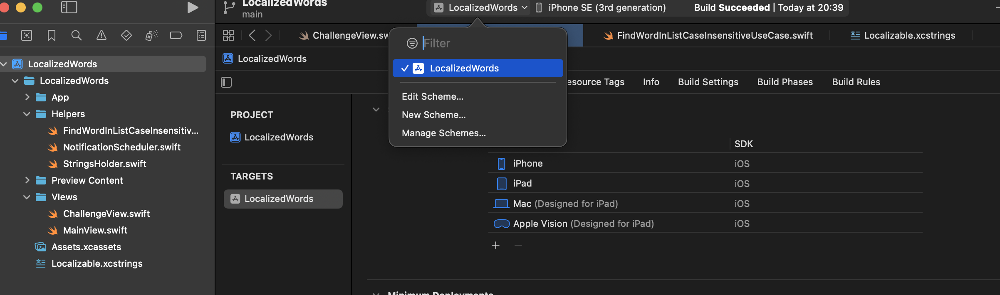
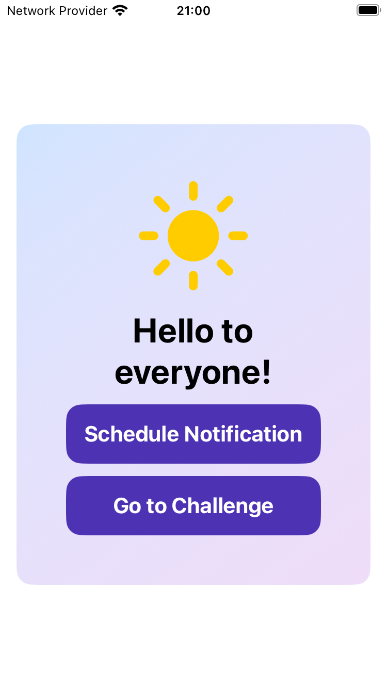
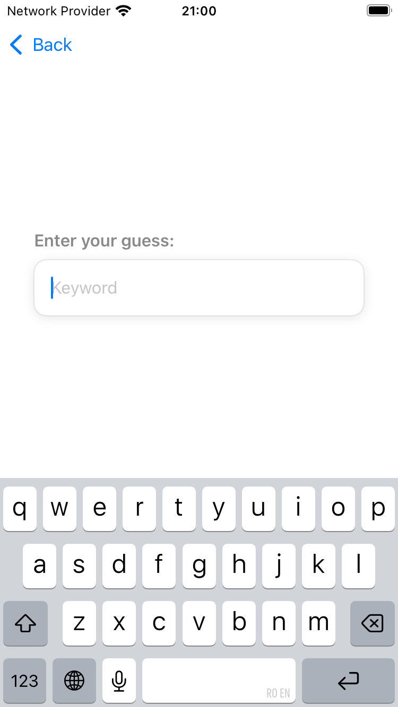

# Localized Words

This repository contains the source code for the article I wrote about Swift localization strings.

You can find the article on [Medium](https://radu-ionut-dan.medium.com/cracking-the-localizable-strings-in-ios-2c5f28d4a45b) or on [my personal blog](https://www.radude89.com/blog/localizable-strings.html).

## How to Run the App

At the time of building this app, I used **Xcode 16.2 (16C5032a)** with **Swift 6.0**. The minimum supported iOS version is **18.2**.

To run the app, simply open the project by selecting the file `LocalizedWords/LocalizedWords.xcodeproj` in Xcode.

Select the scheme "LocalizedWords" and choose a device to run the app on. **NOTE:** You will need a simulator or a physical device that meets the minimum iOS version of 18.2.

## Features of the App

The app consists of two main screens:
- **Main Screen** located in `Views/MainView.swift`.
- **Challenge Screen** located in `Views/ChallengeView.swift`.

| Main Screen | Challenge Screen |
|-------------|------------------|
|  |  |

From the "Main" screen, you can schedule a notification that will display a message localized according to the device's locale.

To navigate to the "Challenge" screen, simply tap the button labeled "Go to Challenge".

The app supports two localizations: English and French.

Feel free to take it for a spin! 🚀
